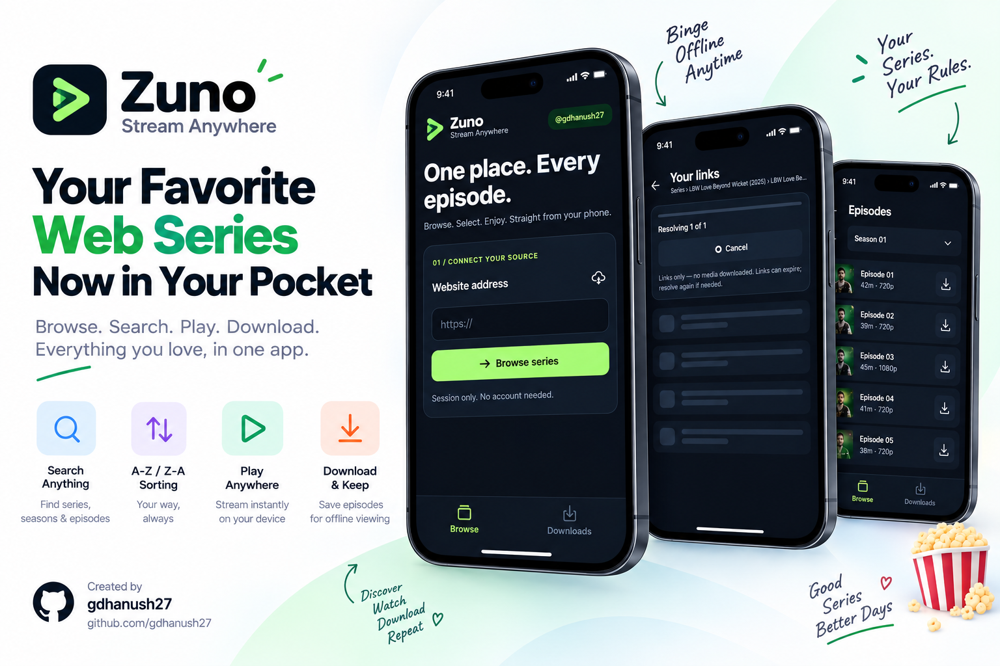
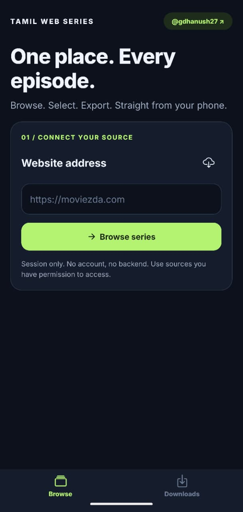
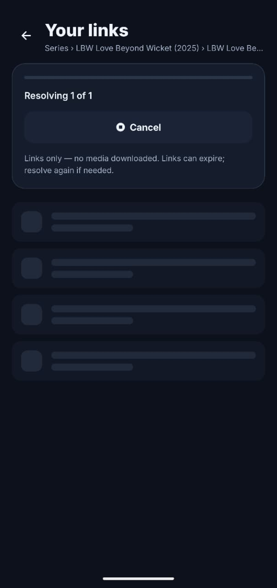
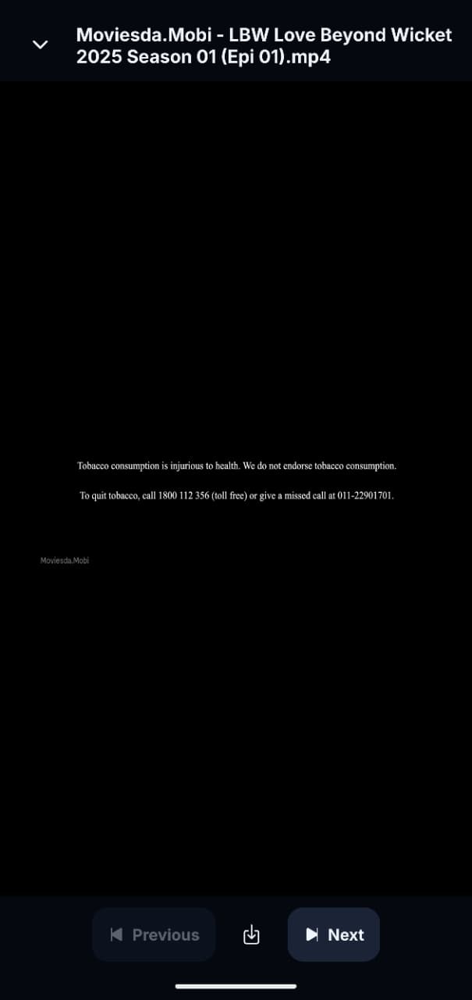

# Zuno — Stream Anywhere

<p align="center">
  
</p>

Your series, your phone, your rules. Zuno finds episodes, lines them up, and keeps your favourites ready to watch even when the signal drops.

No accounts. No clutter. Just search, tap, and press play.

## Why you'll like it

- **Find it fast** — search across catalogs, series, and seasons with smart A-Z sorting.
- **Binge without breaks** — next and previous controls roll straight into the following episode.
- **Watch offline** — saved episodes play from your device, no connection required.
- **Pick up where you left off** — Zuno remembers your spot in every episode.
- **Stays yours** — everything lives on your phone, and deleting a download really deletes it.

## Screenshots

<table>
  <tr>
    <td align="center" width="33%"></td>
    <td align="center" width="33%"></td>
    <td align="center" width="33%"></td>
  </tr>
  <tr>
    <td align="center">Home</td>
    <td align="center">Link fetching</td>
    <td align="center">Player</td>
  </tr>
</table>

## How it works

1. Point Zuno at your source.
2. Browse or search until something catches your eye.
3. Tap the episodes you want.
4. Let Zuno fetch the links.
5. Press play, or save them for the road.

## Get started

```powershell
npm install
npm start
```

Run it on Android:

```powershell
npm run android
```

Already have a development build installed?

```powershell
npm run start:dev
```

## Good to know

- Zuno is built for Android and iOS. The web version is along for the ride, not the show.
- Keep the app open while links are loading or downloads are running.
- Streaming links can expire. If one goes stale, Zuno simply fetches a fresh one.
- Browsing history and search results reset when you close the app. Downloads stay put.
- Please use Zuno only with content you have the right to access.

## Before you ship

```powershell
npm test
npm run typecheck
npm run lint
```

The suite covers the logic. Playback, downloads, and sharing deserve a real device and a comfortable chair.

## License

Zuno is released under the [GNU General Public License v3.0](LICENSE) or later.
